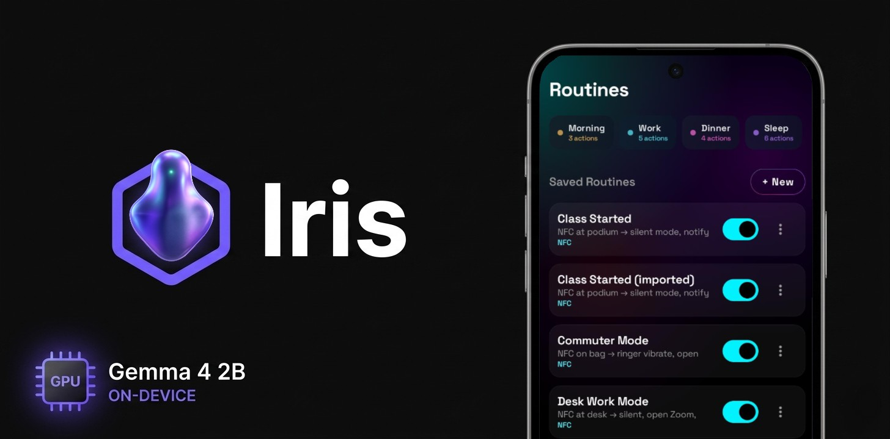

# IrisApp — Android On-Device AI Workflow Automation

> **Platform:** Android (Kotlin + Jetpack Compose + LiteRT-LM)
> **Goal:** On-device SLM turns natural language into executable cross-app workflows.
> **Package:** `com.irisapp`


[](https://creativecommons.org/licenses/by/4.0/)

---

## Architecture

```
User prompt
    │
    ▼
┌─────────────────────────────┐
│   RetoWorkflowPlanner        │  ← 3-stage: Analysis → Capability → ActionPlan → JSON
│   LiteRT-LM (Gemma 4 2B)     │  ← on-device via LiteRT-LM (GPU-accelerated)
└──────────────┬──────────────┘
               │ JSON workflow
               ▼
┌─────────────────────────────┐
│  WorkflowJsonParser          │  ← parse + validate + one repair attempt on failure
│  WorkflowValidator           │  ← ActionSpec allowlist, param types, trigger compat
└──────────────┬──────────────┘
               │ PlannedWorkflow
               ▼
┌─────────────────────────────┐
│  WorkflowRepository          │  ← JSON file storage, survives restart
│  (JsonFileStorage)          │
└──────────────┬──────────────┘
               │
          ┌─────┴─────┐
          ▼           ▼
      Run Now     Trigger
          │           │
          ▼           ▼
    WorkflowRunner   NFC / Time / Share Sheet / Battery / WiFi / …
          │           │
          ▼           ▼
    IntentFactory  AlarmManager / NDEF / ACTION_SEND
          │
          ▼
    Android OS — execute cross-app actions
```

---

## Action Catalog (64 actions)

| Category | Actions |
|---|---|
| **Communication** | `sms.compose`, `whatsapp.send_text`, `phone.dial`, `telegram.send_text` |
| **Calendar** | `calendar.create_event`, `calendar.find_free_slot` |
| **Alarm / Timer** | `alarm.set_alarm`, `alarm.set_timer`, `alarm.cancel_alarm` |
| **Notes** | `note.create`, `google_keep.create_note` |
| **Media** | `media.play_pause`, `media.next_track`, `media.previous_track`, `media.play_from_search`, `youtube.open` |
| **Volume** | `volume.set`, `ringer_mode.set` |
| **Display** | `brightness.set`, `rotation.lock` |
| **Network** | `wifi.toggle`, `bluetooth.toggle`, `hotspot.toggle`, `cellular.toggle`, `airplane_mode.toggle` |
| **Browser** | `browser.open_url`, `browser.search` |
| **App control** | `launch_app`, `app.open` |
| **Clipboard** | `clipboard.copy_text`, `clipboard.copy_image` |
| **Sharing** | `share.share_text`, `share.share_image` |
| **HTTP** | `http_request` |
| **Data** | `command.exec`, `intent.send`, `sync.toggle` |
| **Notifications** | `notification.send`, `toast.show` |

Silent actions (no UI): `calendar.create_event`, `alarm.set_alarm`, `clipboard.copy_text`, `clipboard.copy_image`, `share.share_text`, `share.share_image`, `http_request`, `sync.toggle`, `toast.show`, `notification.send` (with permission).

---

## Trigger System

| Trigger | Setup | Execution |
|---|---|---|
| **Manual** | Always available | Tap "Run" in workflow detail |
| **NFC** | NfcSetupScreen → write tag with `iris://workflow/{id}` | Scan tag → confirm → run |
| **Time** | TimeTriggerSetupScreen → AlarmManager schedule | Notification → Confirm / Dismiss |
| **Share Sheet** | ShareSheetSetupScreen → enable for workflow | Share → pick workflow → confirm → run |
| **Battery Level** | BatteryTriggerSetupScreen | On battery level crossing threshold |
| **Charger** | ChargerTriggerSetupScreen | On plug/unplug |
| **Wi-Fi** | WiFiTriggerSetupScreen | On SSID connect/disconnect |
| **Bluetooth** | BluetoothTriggerSetupScreen | On BT state change |
| **Airplane Mode** | AirplaneModeTriggerSetupScreen | On toggle |
| **Do Not Disturb** | DndTriggerSetupScreen | On DND state change |
| **Geofence** | GeofenceTriggerSetupScreen | On arrive/leave/dwell |
| **SMS Received** | SmsTriggerSetupScreen | On matching SMS |
| **App Opened / Closed** | AppTriggerSetupScreen | AccessibilityService |
| **Sleep Proxy** | SleepTriggerSetupScreen | On sleep/wake |
| **Voice** | VoiceTriggerSetupScreen | On voice intent |
| **Sound Event** | SoundEventTriggerSetupScreen | YAMNet classifier (on-device) |

**Boot persistence:** `BootReceiver` reschedules all time triggers after device reboot. `IrisApp.onCreate()` reschedules on every cold start.

---

## Source Tree

```
app/src/main/java/com/irisapp/
├── app/
│   └── IrisApp.kt                    ← onCreate: registerAll triggers, reschedule
├── data/
│   ├── local/storage/
│   │   └── JsonFileStorage.kt       ← JSON file CRUD
│   └── repository/
│       ├── ExecutionHistoryRepository.kt  ← append-only, last 100
│       ├── MarketplaceRepository.kt      ← Firebase RTDB anonymous marketplace
│       ├── WorkflowRepository.kt         ← save/load/delete workflows
│       └── WorkflowShareRepository.kt    ← Firebase RTDB share via deep-link
├── domain/
│   ├── catalog/
│   │   └── ActionSpecRegistry.kt    ← 64 ActionSpecs
│   ├── model/
│   │   ├── SharedContent.kt         ← sealed Text/Image
│   │   └── WorkflowModels.kt        ← PlannedWorkflow, WorkflowStep, TriggerConfig, ExecutionResult
│   ├── parser/
│   │   └── WorkflowJsonParser.kt    ← parse + validate + one repair attempt
│   ├── planner/
│   │   ├── PromptBuilder.kt
│   │   ├── RequestAnalysis.kt
│   │   └── RetoWorkflowPlanner.kt   ← main planner entry (3-stage pipeline)
│   ├── runner/
│   │   ├── FallbackParamMapper.kt
│   │   ├── IntentFactory.kt
│   │   └── WorkflowRunner.kt         ← step-by-step execution + confirmation gate
│   ├── safety/
│   │   └── WorkflowValidator.kt
│   └── triggers/
│       └── TriggerCatalog.kt        ← TriggerRegistry + registerAll
├── platform/
│   ├── alarm/    AlarmApiExecutor, AlarmReceiver, BootReceiver,
│   │              TimeTriggerReceiver, TimeTriggerScheduler, AlarmTriggerManager
│   ├── app/      LaunchAppApiExecutor, LaunchAppService.kt (FGS with appLaunch subtype)
│   ├── bluetooth/  BluetoothApiExecutor
│   ├── calendar/   CalendarApiExecutor
│   ├── capability/ ChromeCustomTabOpener, ClipboardApiExecutor,
│   │               IntentDiscoveryEngine, PackageCapabilityScanner
│   ├── cellular/   CellularApiExecutor
│   ├── command/    CommandApiExecutor
│   ├── display/   BrightnessApiExecutor, RotationApiExecutor
│   ├── hotspot/    HotspotApiExecutor
│   ├── http/       HttpRequestApiExecutor
│   ├── inference/  InferenceManager, ModelFileLocator, litert/LitertLmEngine
│   ├── intent/     GenericIntentApiExecutor
│   ├── location/   GeofenceManager, GeofenceBroadcastReceiver
│   ├── media/      MediaControlApiExecutor
│   ├── nfc/        DeepLinkRouter (writeMode, deep-link event bus),
│   │               NfcTriggerHandler (cold-start receiver),
│   │               NfcSetupScreen
│   ├── notification/ NotificationApiExecutor
│   ├── share/       ShareSheetTriggerHandler
│   ├── sms/         SmsTriggerManager, SmsTriggerReceiver, SmsNotificationListener
│   ├── sound/       YamnetClassifier, SoundEventTriggerService
│   ├── sync/        SyncApiExecutor
│   ├── tools/       Tool, ToolRegistry, ToolInitializer, ToolAliasRegistry
│   │   └── impl/   ClipboardTools, DeviceTools, DomainSearchTools, ExecutionTools,
│   │               NotificationTools, ReasoningTools, ReminderTools, SearchTools,
│   │               SettingsTools, TemporalTools
│   │   └── reto/   RetoOrchestrator, CapabilityBinder, SlotGroundingPlanner,
│   │               RequirementBuilder, ResolverRegistry, ToolMetadataRegistry
│   ├── trigger/    TriggerRegistry, BatteryTriggerManager, ChargerTriggerManager,
│   │               WiFiTriggerManager, BluetoothTriggerManager, AirplaneModeTriggerManager,
│   │               DndTriggerManager, SleepTriggerManager,
│   │               AppMonitorAccessibilityService, VoiceTriggerHandler, VoiceIntentTrigger
│   ├── volume/     RingerModeApiExecutor, VolumeApiExecutor
│   └── wifi/       WifiApiExecutor
├── ui/
│   ├── MainActivity.kt              ← navigation + PermissionDialog with step-by-step instructions
│   ├── components/                  ← AmbientBackground, BlobPersona, GlassmorphicCard,
│   │                                 GradientButton, LivingInputConsole, SceneChip, HexHeroIcon
│   ├── home/                        ← GenerateScreen, ManualWorkflowEditorScreen,
│   │                                 NfcTriggerSetupScreen, ShareSheetSetupScreen,
│   │                                 TimeTriggerSetupScreen, OsmMapPicker,
│   │                                 SoundEventTriggerSetupScreen,
│   │                                 WorkflowGenerationUiState, WorkflowGenerationViewModel,
│   │                                 ImportWorkflowScreen
│   ├── marketplace/                 ← MarketplaceScreen, MarketplaceViewModel, MarketplaceUiState
│   ├── nfc/                         ← NfcSetupScreen (write state machine)
│   ├── theme/                       ← IrisTheme
│   └── trigger/                    ← TimeTriggerConfirmationActivity,
│                                     TimeTriggerNotification, TimeTriggerPicker
└── widget/                          ← WorkflowWidgetGlance, WorkflowWidgetReceiver,
                                        WorkflowWidgetConfigActivity, IrisWidgetStateRepository,
                                        WidgetPreferences, TriggerWorkflowAction, SlmExecutionService
```

---

## Build

```bash
# Push model to device (one-time)
adb push local_models/gemma-4-E2B-it.litertlm \
  /sdcard/Android/data/com.irisapp/files/models/

# Build (from PowerShell/CMD on Windows — no Java in WSL)
.\gradlew installDebug
```

---

## Documentation Map

|| File | Purpose |
|---|---|---|
| `docs/PROJECT_CONTEXT.md` | Current project state, architecture decisions, file inventory |
| `docs/background-execution-analysis.md` | Background execution compatibility (triggers + actions) |
| `docs/MILESTONE_6_STATUS.md` | Milestone 6 completion status (workflow lifecycle) |
| `docs/implementation/EXECUTION_PIPELINE.md` | End-to-end execution flow details |
| `docs/implementation/P1_TRIGGERS_PLAN.md` | Geofence, SMS, Own Alarm implementation plan |
| `docs/action_implementation_plan.md` | P1–P4 action implementation guide |
| `docs/UX_ANALYSIS.md` | Dark theme UX analysis (Phases 1–8 completed) |
| `docs/WIDGET_RESEARCH_REPORT.md` | Glance vs RemoteViews widget research |
| `docs/demo-script.md` | Demo script with scene breakdown and VO |